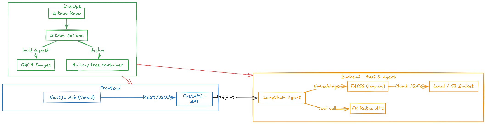

# Proyecto Banco Guayaquil – Agente de IA Financiero con RAG

**Chapter Lead AI / Isaac Reyes**

---

## 🧠 Visión General

Este proyecto implementa un Agente Inteligente Financiero diseñado para responder preguntas sobre documentos financieros internos (en PDF) mediante una arquitectura RAG (Retrieval-Augmented Generation), complementado con herramientas externas como una API de conversión de divisas y un webscraper automatizado.  
El agente está orientado a ayudar a analistas, gerentes financieros y clientes internos de Banco Guayaquil a obtener insights rápidos, precisos y confiables de la información documental y del mercado.

---

## 🚀 Caso de Uso

> *Un analista financiero desea saber qué pasivos corrientes registró la empresa XYZ en el último trimestre, y cuánto representa esto en USD al tipo de cambio actual.*

---

## ⚙️ Arquitectura del Sistema

### 🔧 **Componentes Principales**

- **Frontend Web**: Interfaz moderna y minimalista en React/Next.js, con soporte para subida de archivos, chat y temas.
- **Backend API**: Servidor FastAPI central.
- **Agente RAG**: Implementado con LangChain, que decide dinámicamente entre búsqueda documental y herramientas externas.
- **Vector DB**: FAISS (embeddings OpenAI o HuggingFace) para búsquedas semánticas sobre los PDFs.
- **Tool Externa**: Conversión EUR→USD usando API pública de tasas de cambio.
- **Webscraper**: Script Python automatizado para descargar y agregar informes económicos relevantes (BCE, Economic Bulletin) al índice.

### 📊 **Flujo RAG**

1. El usuario realiza una consulta desde el frontend.
2. El agente decide:
   - ¿Buscar contexto en documentos PDF internos?
   - ¿Llamar la tool de conversión de divisas?
3. Genera la respuesta con contexto financiero y funciones auxiliares.

### 📈 **Arquitectura Visual**



## 🛠️ Instalación y Ejecución

### 1. Clona el repositorio

```
git clone https://github.com/BancoGuayaquil/ai-financial-agent.git
cd wealth-insight-assistant
```
## Docker
docker-compose up --build
Frontend: http://localhost:3000

Backend API: http://localhost:8000/api/v1/query

RENDER Y VERCEL DEPLOY